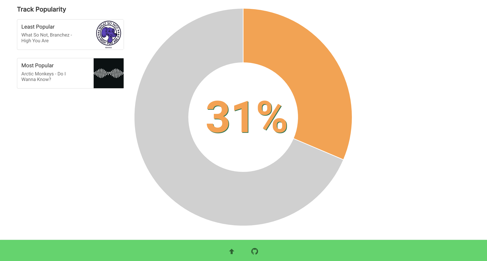
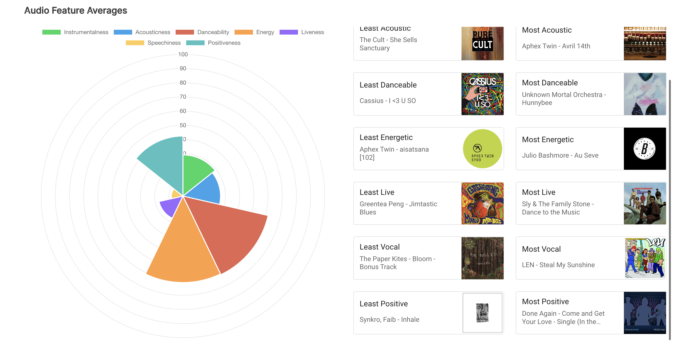

# Spotify Unwrapped

[](https://dl.circleci.com/status-badge/redirect/gh/jemgunay/spotify-unwrapped/tree/main)

A web app for visualising Spotify playlist data.

## Screenshots

<p align="center">
  
  
</p>
<p align="center">
  
  
</p>

## Usage

```bash
go run main.go
# debug logs, e.g. full egress request logs
go run main.go -debug

cd ui
npm run serve
```

## TODO

* Add tooltips to explain audio feature meanings
* Persist playlist ID in URL
* Visualisation ideas
    * Key/tempo vs valence
    * Pie chart of artist genre frequency in a playlist
    * Artist country
