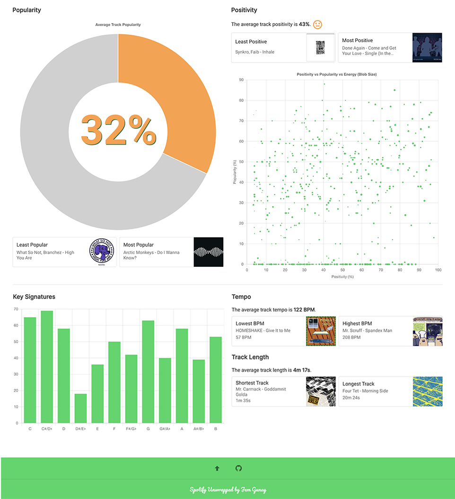

# Spotify Unwrapped

[](https://dl.circleci.com/status-badge/redirect/gh/jemgunay/spotify-unwrapped/tree/main)

A web app for visualising Spotify playlist data.

## Screenshots

<p align="center">
  
  
</p>

## Usage

```bash
# set the env vars defined in config/default.env
go run main.go
# debug logs, e.g. full Spotify API request logs
go run main.go -debug

cd ui
npm run serve
```

## TODO

* Add tooltips
* Add general info btn for implementation details/limitations (i.e. max tracks per query)